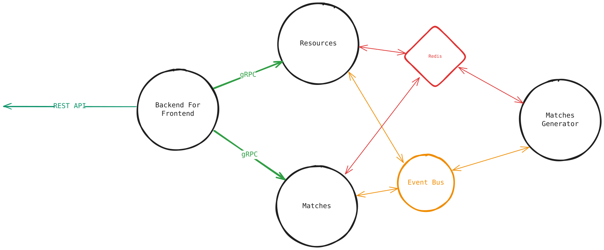

# Sports Tournament Scheduling System

Welcome to the Sports Tournament Scheduling (STS) System! This repository contains a microservices-based application designed to manage sports leagues, teams, stadiums, and automatically generate optimal timetables for tournaments.

## 🏗 Architecture Overview

The system is built using a modern microservices architecture with a combination of .NET Core for APIs, Python for heavy computational scheduling, and React for the frontend.
<div align="center">
 
</div>

### Microservices

1. **STS.BFF (Backend-For-Frontend)**
   - Acts as an API Gateway tailored for the web UI.
   - Built with ASP.NET Core.
   - Communicates with backend microservices via gRPC.
   
2. **STS.Resources API**
   - Manages core entities: Leagues, Stadiums, Teams, and Time Slots.
   - Built with ASP.NET Core.
   - Uses a dedicated PostgreSQL database (`ResourcesDb`).
   - Integrates with SpiceDB for fine-grained permissions.

3. **STS.TimeTables API**
   - Manages tournament timetables and schedules.
   - Built with ASP.NET Core.
   - Uses a dedicated PostgreSQL database (`TimeTableDb`).
   
4. **TimeTable Generator (`sts_timetable_generator`)**
   - A Python-based worker service.
   - Responsible for running the core scheduling algorithm.
   - Listens to RabbitMQ for generation requests and uses Redis for caching and tracking state.

5. **Web UI (`sts-web-ui`)**
   - The user-facing frontend application.
   - Built with React.
   - Connects to the STS.BFF service.

### Infrastructure & Dependencies

The system relies on the following infrastructure components, all conveniently orchestrated via Docker Compose:

- **PostgreSQL**: Stores relational data for microservices.
- **Redis**: Used for caching and intermediate state storage for the generator.
- **RabbitMQ**: Message broker facilitating asynchronous communication (e.g., between APIs and the Python generator).
- **Keycloak**: Identity and Access Management (IAM) for authentication.
- **SpiceDB**: Fine-Grained Authorization (FGA) service.

## 🚀 Getting Started

### Prerequisites

Ensure you have the following installed on your machine:
- [Docker](https://docs.docker.com/get-docker/)
- [Docker Compose](https://docs.docker.com/compose/install/)

### Running the Application

The entire stack can be spun up using Docker Compose. From the root directory of the repository, run:

```bash
docker-compose up -d --build
```

This command will:
- Pull the necessary infrastructure images (PostgreSQL, Redis, RabbitMQ, Keycloak, SpiceDB).
- Build the Docker images for the .NET microservices, the Python generator, and the React UI.
- Start all containers.

### Accessing the Services

Once the containers are running, you can access the services at the following URLs:

- **Web UI**: `http://localhost:3000`
- **BFF API**: `http://localhost:8080`
- **Resources API**: `http://localhost:8081`
- **TimeTables API**: `http://localhost:8082`
- **Keycloak Admin Console**: `http://localhost:8086` (Username: `admin`, Password: `admin_password`)
- **RabbitMQ Management UI**: `http://localhost:15672` (Username: `admin`, Password: `password`)

## 🔐 Authentication

Authentication is handled by Keycloak. On startup, Keycloak is bootstrapped with a realm export (`realm-export.json`) that pre-configures the `sts` realm and necessary clients.

## 🛠 Tech Stack

- **Backend**: C#, ASP.NET Core, gRPC, Entity Framework Core
- **Worker**: Python
- **Frontend**: React, TypeScript (assumed)
- **Databases**: PostgreSQL, Redis
- **Messaging**: RabbitMQ
- **Security**: Keycloak (OIDC), SpiceDB (Zanzibar FGA)
- **Deployment**: Docker, Docker Compose
